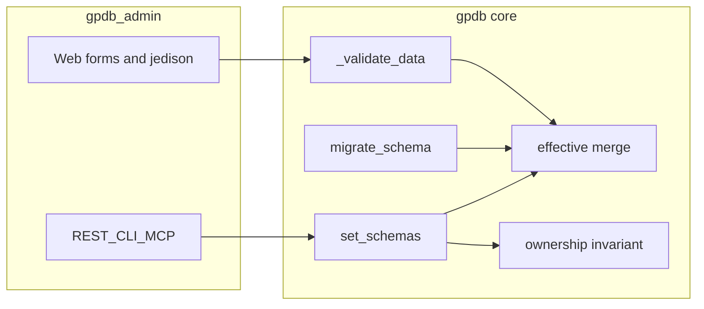

# Schema Multiple Inheritance

Wheras we have a schema system for Nodes and Edges, and
- schemas are called "types", e.g. a node type or a edge type, and
- schemas are enforced on Nodes and Edges when they are created/updated, and
- each node/edge has exactly one schema, and
- schemas have no current hierarchy or inheritance or composition

And crucially, when changing a schema that already has nodes/edges using it,
- migration is accomplished by passing a python function in that takes the node/edge and upgrades it
- migration is atomic, either all nodes/edges are migrated successfully, or the entire migration fails without changing the db

This forces effort onto the gpdb clients in real life, for example:
- If they define a "person" schema, and then extend it to an "admin" schema, they must duplicate the fields of the "person" schema on the "admin" schema
- If they then update the "person" schema, they must separately manually update the "admin" schema
- It is not possible to update multiple schemas at once, thus if there are duplicate fields, migration on "person" can succeed, followed by migration on related schema "admin" failing, creating an inconsistent state where the "admin" is no longer an extension of a person
- If a schema is meant to extend another, the client must keep track of it, there's no built in info saying "admin" is meant to extend "person"

We aim to mitigate these problems:
- proliferation of redundant and duplicate fields across multiple schemas
- risk of schemas being out of sync, incomplete migrations
- no clarity on what schemas extend what

# Enabling Constraint

The key constraint to our inheritance/composition upgrade is the migration.
We must maintain the ability for a parent schema to be changed (which effectively changes all child schemas),
and the parent migration function must be able to migrate not just nodes and edges that are of the parent schema,
but also all those downstream nodes and edges that are descendants of the parent schema.

To enable this, we add a crticial constraint to the inheritance/composition:

## Additive Inheritance Only

No child schema, or other schema in a composition if doing multiple inheritance, may EVER express
anything about a parent's field.

For example, if "email" is defined on "person" schema, then "admin" schema may not ever have anything
to do with the field "email" - it cannot redefine it, it cannot do anything with it.

This validation ensures the following:
- Only the parent schema *ever* touches the email field during migrations.
- All migrations can be handled knowing only the schema that is to be migrated, and it does not matter whether the fields appear on inherited child or grandchildren, they are always present exactly as described in the field.

This means there is only ever ONE schema that is in charge of a given field on an object, no matter how many other schemas it extends directly or as an ancestor.

This additive inheritance operates AT THE TOP LEVEL FIELDS, e.g. if "person" defines a sub-object "metadata" that sub-object become off-limits to all schemas that extend or compose next to "person" - we do not look below the top level when we enforce this constraint - to ensure that the migration of the parent "person" will never be freaked out by changes to the internals of a field object it's schema defiens.

## Multiple Inheritance Plan

We will add multiple inheritance via a new "extends" field on the schema that can take the name of 0 or more parent schemas.

Since each schema will never overlap with another schema with which it is composed, the order of inheritance does not matter,
and we do not have the diamond problem of inheritance.

What we have as our complexity, instead, is the validation of schema changes and compositions. Creating a new schema "C" that inherits from "B" and "A" now puts "B" and "A" into a relationship, and our system must be capable of detecting those relationships when the user edits schema "A", it must reject edits that would put it into conflict with "B", despite the relationship being formed downstream by "C".

By putting this complexity into our Create/Edit schema methods, we can isolate it from the user, who can get back a nice message telling them they can't add field "X" to schema "A", because it conflicts with field "X" that is on schema "B".

## Field Changes to Schemas

In order to make this happen, we will make two changes to the Schema definitions:

1. "extends" field, which is a list of the names of schemas that this schema composes from.
2. "effective_json_schema", which is the combined schema after all ancestors have been merged into it.
  - Effective schema cannot be submitted by users, it is available when fetching a schema but not possible to set directly.
  - On schemas that do not have any ancestors, effective schema is omitted.
  - Downstream users of schemas should check if effective schema exists, and use it for validation if so, otherwise use json_schema when it is not included

## Misc Notes

- We do not need to specify kind when specifying the extends, since we can always assume it is the same as the kind on the child schema - e.g. a node schema can only extend other node schemas
- Validation of schema inheritance rules happens when schemas are created/updated
- Migrations either fail or succeed across all impacted objects (e.g. those of the migrated schema and descendant schemas, all in one transaction)
- When migrating an object of a descendant schema, while the migration function only considers the current schema, the validation function must validate against the full effective schema for that object (e.g. the descendant's effective schema)
- Migrations receive the full object, it is up to the writer of the migration function not to interefere with fields that aren't part of the schema (unless they want)
- Error messages, where possible, should show the full inheritance detail / help the user figure out in a complex world of schemas, what they would need to do to fix it
- Effective schemas are pre-computed and stored on the schema
- Schemas obviously cannot be deleted if they have ancestors
- When a parent schema is changed, all descendants' effective_schemas are recomputed (and used to validate their objects' migration) in the same migration transaction

# Implementation Plan

---
name: Schema inheritance implementation
overview: Implement additive multiple schema inheritance in the core `gpdb` package first (storage, merge, validation, migration, node/edge validation), then surface `extends` and read-only `effective_json_schema` through `gpdb-admin` APIs and web UI, with tests covering inheritance invariants and descendant migration behavior.
todos:
  - id: m1-orm-dto
    content: Add extends + effective_json_schema columns to _GPSchema and create_schema_model; extend SchemaUpsert with extends; add SchemaInheritanceError
    status: pending
  - id: m1-inheritance-module
    content: Implement schema_inheritance.py (keys, merge, effective compute, cycle/toposort, global invariant)
    status: pending
  - id: m1-graph-schemas
    content: Wire set_schemas/delete_schemas/migrate_schema/_get_validator to inheritance + effective + cache invalidation
    status: pending
  - id: m1-tests
    content: Add test_schema_inheritance.py; extend test_schema_migration, test_schema_deletion, existing schema tests
    status: pending
  - id: m2-admin-models-api
    content: Update GraphSchema* models, graph_params, graph_content/schemas, serialize_schema_record
    status: pending
  - id: m2-admin-web
    content: Schema form/detail + node_form schema_json_map uses effective when present
    status: pending
  - id: m2-admin-tests
    content: Extend gpdb_admin/tests/test_schemas.py (and node form map if needed)
    status: pending
isProject: false
---

# Schema multiple inheritance — implementation plan

This plan implements [plans/schema_multiple_inheritance.md](plans/schema_multiple_inheritance.md) in two milestones. It assumes **no backward compatibility** per project rules: new columns on the schema table, DTO/API shape updates, and **no shims** for old rows (fresh `create_tables` / new graphs are the happy path; existing DBs without new columns would need a one-off DBA `ALTER` if someone keeps old data).

---

## Design anchors (from current code)

- Schema CRUD lives in `[src/gpdb/graph_schemas.py](src/gpdb/graph_schemas.py)` (`set_schemas`, `delete_schemas`, `migrate_schema`, `_get_validator`, `_validate_data`).
- Schema ORM: `[src/gpdb/models/records.py](src/gpdb/models/records.py)` `_GPSchema` and `[src/gpdb/models/factories.py](src/gpdb/models/factories.py)` `create_schema_model`.
- Node/edge payload validation calls `_validate_data` from `[src/gpdb/graph_nodes.py](src/gpdb/graph_nodes.py)` / `[src/gpdb/graph_edges.py](src/gpdb/graph_edges.py)`.
- Admin surface: `[gpdb_admin/src/gpdb/admin/graph_content/schemas.py](gpdb_admin/src/gpdb/admin/graph_content/schemas.py)`, models in `[gpdb_admin/src/gpdb/admin/graph_content/models.py](gpdb_admin/src/gpdb/admin/graph_content/models.py)`, serialization in `[gpdb_admin/src/gpdb/admin/graph_content/_helpers.py](gpdb_admin/src/gpdb/admin/graph_content/_helpers.py)`, ToolAccess params in `[gpdb_admin/src/gpdb/admin/tools/graph_params.py](gpdb_admin/src/gpdb/admin/tools/graph_params.py)`. Node form uses **per-type JSON Schema** from `list_graph_schemas(..., include_json_schema=True)` in `[gpdb_admin/src/gpdb/admin/web/routes/graph_nodes.py](gpdb_admin/src/gpdb/admin/web/routes/graph_nodes.py)`.

---

## Milestone 1 — `gpdb` library

### 1. Database and ORM models

| Change                                      | Where                                                                                                                                                    |
| ------------------------------------------- | -------------------------------------------------------------------------------------------------------------------------------------------------------- |
| Add `extends: JSONB`                        | Default `[]` (empty list). Store ordered list of parent **names** (same `kind` only; enforced in validation).                                            |
| Add `effective_json_schema: JSONB` nullable | `NULL` when `extends` is empty; non-null when there are ancestors (matches spec: omit when no ancestors — implement as null in DB, omit in serializers). |

Update both `[_GPSchema](src/gpdb/models/records.py)` and `[create_schema_model](src/gpdb/models/factories.py)` so prefixed and default tables stay aligned.

**DTO:** extend `[SchemaUpsert](src/gpdb/models/dto.py)` with `extends: list[str] \| None = None` (update semantics: `None` = leave unchanged; `[]` = clear extends). **Do not** add `effective_json_schema` to `SchemaUpsert` — it is server-only.

### 2. Effective schema merge (pure functions)

Add a focused module, e.g. `[src/gpdb/schema_inheritance.py](src/gpdb/schema_inheritance.py)` (name can match project taste), containing:

- `**top_level_property_keys(schema: dict) -> frozenset[str]`** — keys of `properties` only; if `properties` missing, treat as empty (additive rule applies to declared top-level property names only).
- `**merge_object_json_schemas(partials: list[dict]) -> dict**` — deterministic merge for `type: object` style GPDB schemas: union `properties`, merge `required` as union, reconcile `additionalProperties` conservatively (e.g. if any parent disallows extras, effective disallows; document the rule in code). Handle `$defs` / local refs by **requiring** merged branches to keep disjoint `$defs` keys or inline consistently — start with the same patterns already used in tests (`[tests/test_graph_schemas.py](tests/test_graph_schemas.py)` `$defs` case) and extend tests if merge must copy defs from parents.
- `**compute_effective_row(own_json_schema, parent_effectives: list[dict]) -> dict | None`** — returns `None` if no parents; else merged effective dict.

These functions are **unit-testable** without a DB.

### 3. Graph-wide inheritance graph and validation (where validations live)

Implement **one global invariant** per `kind` (node vs edge treated separately because `(name, kind)` is the PK):

> For every schema `U`, let `Ancestors(U)` be the transitive closure of `extends`. Let `Keys(S)` be `top_level_property_keys(S.json_schema)`. Then for every `U`, the sets `{ Keys(S) : S in {U} ∪ Ancestors(U) }` must be **pairwise disjoint**.

This implies:

- Multiple parents of one child must have **disjoint** top-level keys (so there is no diamond conflict).
- A child’s own keys must not overlap any ancestor’s keys (**additive inheritance**).
- Editing parent `A` cannot introduce a key that already appears on any **co-ancestor** `B` for **some** descendant `C` (the spec’s “C links A and B” case). The invariant above covers this: after the edit, some `U` (e.g. `C`) would have two ancestors owning the same key.

**Where to run it**

| Operation                     | Validation entrypoint                                                                                                                                                                                                                                                                                                                                                                                                                                                                                    |
| ----------------------------- | -------------------------------------------------------------------------------------------------------------------------------------------------------------------------------------------------------------------------------------------------------------------------------------------------------------------------------------------------------------------------------------------------------------------------------------------------------------------------------------------------------- |
| `set_schemas` (create/update) | After resolving the **batch** of upserts into a proposed registry (see below), recompute all `extends` edges and all `effective_json_schema` values **in memory**, run the invariant, then persist. On failure raise a dedicated exception e.g. `**SchemaInheritanceError`** (add in `[src/gpdb/models/base.py](src/gpdb/models/base.py)` and export from `[src/gpdb/models/__init__.py](src/gpdb/models/__init__.py)`) with messages that name **conflicting schema names and field names** (per spec). |
| `delete_schemas`              | Before delete, reject if any schema **row** has this `(name, kind)` in its `extends` list (reverse lookup: scan schemas of same kind, or maintain in-memory from query).                                                                                                                                                                                                                                                                                                                                 |
| `__default__`                 | Reject non-empty `extends` and reject any schema that lists `__default__` as a parent (keeps bootstrap simple).                                                                                                                                                                                                                                                                                                                                                                                          |

**Batch `set_schemas` ordering:** Build a proposed map `name -> row` = DB state overlaid by the batch. Topologically sort by `extends` among proposed rows; detect cycles. If the batch introduces a parent and child together, sort ensures merge sees parents first. Single flush after validation.

**Caching:** Today `[_get_validator](src/gpdb/graph_schemas.py)` caches by `(name, kind)`. After inheritance, either key cache by `(name, kind, version)` or **clear the entire `_validators` map** on any successful schema write (simplest, correct). Same for any cache that assumed `json_schema` alone defined validation.

### 4. `_get_validator` / `_validate_data` behavior

- Load schema row; build validator from `**effective_json_schema` if not null, else `json_schema`** (per spec for downstream callers).
- Kind checks stay as today.

### 5. `migrate_schema` (parent + descendants, one transaction)

Current behavior in `[migrate_schema](src/gpdb/graph_schemas.py)`: only `type == name` nodes/edges, validates against **one** merged `json_schema` for that name.

**New behavior:**

1. Resolve **descendant schema names** for the same `kind`: all schemas whose transitive `extends` includes `name` (including `name` itself).
2. For **each** node/edge whose `type` is in that set, run `migration_func` on `data` (same callable for all — writer branches on `type` if needed; matches spec).
3. After applying the migration to the **parent**’s stored `json_schema`, **recompute and persist `effective_json_schema` for the parent and every descendant** (order: parents before children).
4. **Validate** each migrated payload with the **Draft7Validator for that record’s `type`** using the **new** effective schema for that type (descendant validation uses descendant effective).
5. Keep **atomic** semantics: same single transaction; on any validation failure, full rollback (existing tests in `[tests/test_schema_migration.py](tests/test_schema_migration.py)` should be extended, not weakened).

**SemVer:** Keep bumping **only the migrated schema row’s** `version` based on `json_schema` delta as today; descendants get **effective** recomputed without requiring their own semver bump (their `json_schema` unchanged). Document that consumers should rely on stored `effective_json_schema` / fetch, not only child `version`, for effective shape.

### 6. Core tests (new / extended files)

| Scenario                                                                                                                                   | Suggested location                                                                                                                       |
| ------------------------------------------------------------------------------------------------------------------------------------------ | ---------------------------------------------------------------------------------------------------------------------------------------- |
| Disjoint parent/child create; child data validates against merged effective                                                                | New `tests/test_schema_inheritance.py`                                                                                                   |
| Child `json_schema` reuses parent top-level key → `SchemaInheritanceError` names parent + key                                              | same                                                                                                                                     |
| Two parents with overlapping keys → error when creating child that extends both                                                            | same                                                                                                                                     |
| Cycle in `extends`                                                                                                                         | same                                                                                                                                     |
| Unknown parent / self-extend                                                                                                               | same                                                                                                                                     |
| Update parent adds key that collides with co-parent’s key under a shared descendant                                                        | same                                                                                                                                     |
| `delete_schemas` blocked when another schema extends target                                                                                | extend `[tests/test_schema_deletion.py](tests/test_schema_deletion.py)`                                                                  |
| `effective_json_schema` null for roots; non-null for children; merge sanity (`required`, multiple props)                                   | `test_schema_inheritance.py` + small cases in `schema_inheritance` unit tests                                                            |
| `migrate_schema`: nodes of **descendant** types migrated; validation uses **descendant** effective schema; transaction rollback on failure | extend `[tests/test_schema_migration.py](tests/test_schema_migration.py)`                                                                |
| Batch `set_schemas` creates parent+child in one call                                                                                       | `test_schema_inheritance.py`                                                                                                             |
| Existing tests updated for new columns (fixtures, assertions that ignore extra ORM attrs)                                                  | `[tests/test_graph_schemas.py](tests/test_graph_schemas.py)`, `[tests/test_schema_validation.py](tests/test_schema_validation.py)`, etc. |

Run full `pytest` from repo root with `.venv` per project rules.

---

## Milestone 2 — `gpdb_admin`

### 1. Pydantic / ToolAccess models

- `[GraphSchemaCreateParam](gpdb_admin/src/gpdb/admin/graph_content/models.py)` / `[GraphSchemaUpdateParam](gpdb_admin/src/gpdb/admin/graph_content/models.py)`: add `extends: list[str] \| None` (update: `None` = unchanged).
- `[GraphSchemaRecord](gpdb_admin/src/gpdb/admin/graph_content/models.py)`: add `extends: list[str]`; add `effective_json_schema: dict \| None = None` (omit when serializing if null — Pydantic `model_dump(exclude_none=True)` where appropriate).
- `[graph_params.py](gpdb_admin/src/gpdb/admin/tools/graph_params.py)`: thread `extends` through any flat create params if they duplicate fields (follow “one param model per operation” spirit: bulk create already uses `GraphSchemaCreateParam`).

### 2. Graph content service

- `[create_graph_schemas](gpdb_admin/src/gpdb/admin/graph_content/schemas.py)` / `[update_graph_schemas](gpdb_admin/src/gpdb/admin/graph_content/schemas.py)`: pass `extends` into `SchemaUpsert`; map `**SchemaInheritanceError`** → `GraphContentValidationError` with message passthrough.
- `[serialize_schema_record](gpdb_admin/src/gpdb/admin/graph_content/_helpers.py)`: include `extends` and `effective_json_schema` (only non-null effective).

### 3. Web UI

- `[pages/schema_form.html](gpdb_admin/src/gpdb/admin/web/templates/pages/schema_form.html)` (and related): field for **extends** (comma-separated or multi-line names — match existing form patterns); show **read-only effective JSON** on edit/detail when present.
- `[schema_detail.html](gpdb_admin/src/gpdb/admin/web/templates/pages/schema_detail.html)`: show `extends` and effective schema preview.
- `[graph_nodes.py](gpdb_admin/src/gpdb/admin/web/routes/graph_nodes.py)` `schema_json_map`: use `**effective_json_schema` if set, else `json_schema`** so Jedison matches server validation for inherited types.

### 4. Admin tests

- Extend `[gpdb_admin/tests/test_schemas.py](gpdb_admin/tests/test_schemas.py)`: create/update with `extends` via REST/MCP/web; detail/list include `extends` and effective when expected; error payload when inheritance invalid.
- Optional focused test that node create form receives effective schema in `schema_json_map` for an inherited type.

---

## Risk notes (short)

- **JSON Schema merge** is the main technical risk; keep v1 merge rules strict and documented, expand as real schemas demand.
- **Performance:** full-graph revalidation on each `set_schemas` is O(n) per kind — fine for typical registry sizes; optimize later if needed.

